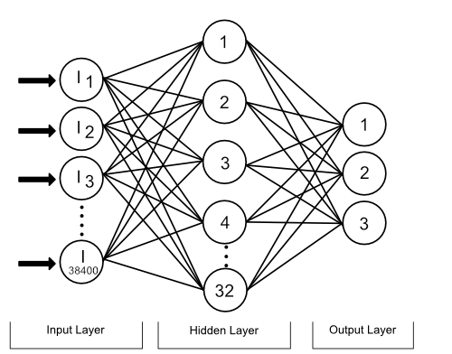

# Self Driving Car

A Self driving scaled car, demonstrating the power of a simple neural network using just a Raspberry Pi.

# Video Demo


# Uasge
Collect Training Images
```
python neural_network_training/collect_training_images.py
```

Train Neural Network
```
python neural_network_training/train_mlp.py <network_file_name>
```

Start Self Drive Mode
```
python neural_network_training/self_drive.py <network_file_name> <drive_duration>
```

# Built With
* Python
* [NumPy](http://www.numpy.org/) - Fundamental package for scientific computing with Python
* Raspberry Pi
* [Scikit-learn](http://scikit-learn.org/stable/) - Machine Learning in Python Library
* [OpenCV 3](https://opencv.org/) - Open Source Computer Vision Library

# Neural Network Architecture
Adopts a feed forward network, with an input, hidden and output layer.

* Input layer - 38,400 inputs, one for each pixel
* Hidden layer - Reduced to 32 nodes
* Output layer - 3 nodes, one for each direction of steering

## Acknowledgments
* https://github.com/FRC4564/Xbox

# Corresponding Web App
There is also a web app which provides an interface to control the car, take a look at the web app repository [here](https://github.com/kylehigginson11/driverless_car_app).


